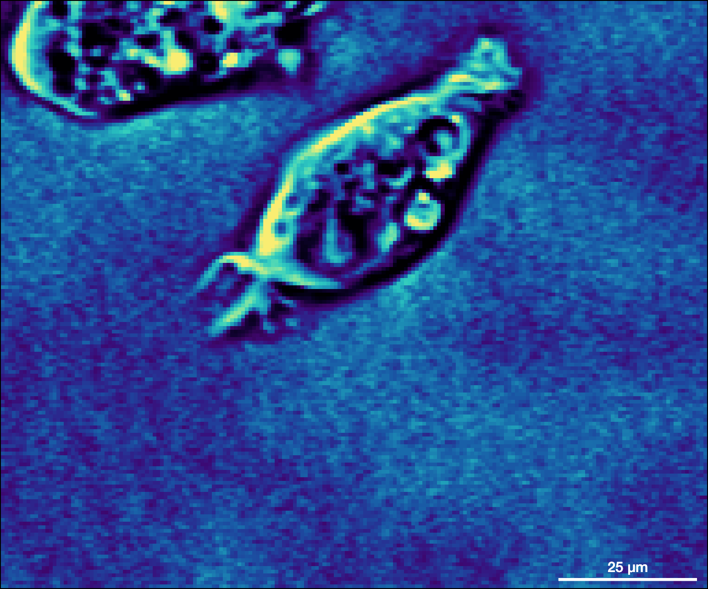
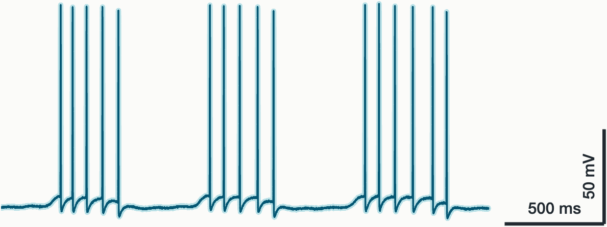
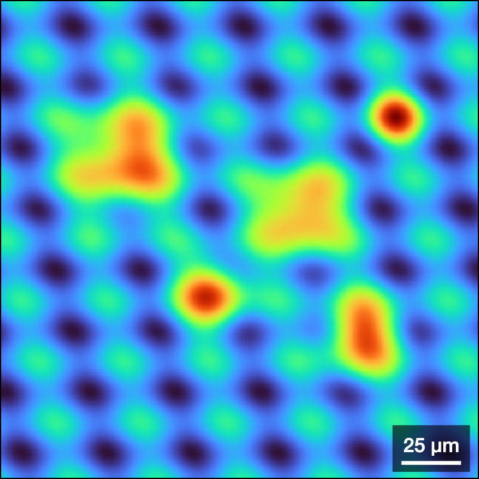

# scalebar

[](https://github.com/ehennestad/scalebar-matlab/releases/latest)
[](https://se.mathworks.com/matlabcentral/fileexchange/109114-scalebar-for-images-and-plots)
[](https://github.com/ehennestad/scalebar-matlab/actions/workflows/test-code.yml)
[](https://codecov.io/gh/ehennestad/scalebar-matlab)
[](https://github.com/ehennestad/scalebar-matlab/security/code-scanning)
[](https://github.com/ehennestad/scalebar-matlab/actions/workflows/run-codespell.yml)
[](https://gitHub.com/ehennestad/scalebar-matlab/graphs/commit-activity)

`scalebar` adds configurable horizontal and vertical scale bars to MATLAB axes. It is intended for calibrated images and plots whose axes have meaningful units. Scale bars update when axes limits or size change, and can be configured through properties or their context menu.

## Examples

### Calibrated image

The [complete image example](src/examples/createImageExample.m) creates the
following pseudocoloured microscopy image and adds a 25 µm scale bar. From the
repository root, run it with:

```matlab
addpath("src/examples")
createImageExample
```

<p align="center">
  
</p>

### Plot data

The [complete plot example](src/examples/createPlotExample.m) simulates a
membrane-potential trace and adds horizontal and vertical scale bars. From the
repository root, run it with:

```matlab
addpath("src/examples")
createPlotExample
```



### Semi-transparent background

The [complete background example](src/examples/createBackgroundExample.m) places
a scale bar over a visually busy simulated fluorescence image and enables a
semi-transparent background to keep the scale bar readable. From the repository
root, run it with:

```matlab
addpath("src/examples")
createBackgroundExample
```

<p align="center">
  
</p>

## Requirements

MATLAB R2021a or later.

The image example additionally requires Image Processing Toolbox for MATLAB's
`cell.tif` sample image and contrast processing. The `scalebar` class and plot
example have no toolbox dependency.

## Installation

Install **scalebar** from MATLAB's **Add-On Explorer**; it manages the MATLAB
path automatically. Alternatively, select **Download** and then **Install** on
the [scalebar File Exchange page](https://se.mathworks.com/matlabcentral/fileexchange/109114-scalebar-for-images-and-plots).

## Quick start

Create an image and add a horizontal scale bar in the lower-right corner:

```matlab
figure(Color="k")
imagesc(peaks(256))
axis image off
colormap turbo

scalebar(50, "pixels", ...
    Location="southeast", ...
    Color="w", ...
    LineWidth=2)
```

## Usage

```matlab
hScalebar = scalebar()
hScalebar = scalebar(scalebarLength)
hScalebar = scalebar(scalebarLength, unitLabel)
hScalebar = scalebar(hAxes, ___)
hScalebar = scalebar(___, Name=Value)
```

- `hAxes` is the target axes. If omitted, the current axes is used.
- `scalebarLength` is the physical length to display. If omitted, an appropriate length is calculated from the axes limits.
- `unitLabel` is the text appended to the displayed length. Use `'um'` for a micrometre label.
- `Axis="x"` creates a horizontal bar; `Axis="y"` creates a vertical bar.

The constructor accepts character vectors and string scalars. It returns a handle object, so appearance can be changed after creation:

```matlab
hScalebar = scalebar(10, "mm", Location="northwest");
hScalebar.Color = "w";
hScalebar.Location = "northwest";
```

### Name-value options

| Option | Description |
| --- | --- |
| `Axis` | Scale-bar orientation: `"x"` or `"y"`. |
| `ConversionFactor` | Number of data units per scale-bar unit. For example, use `2` when two pixels represent one micrometre. |
| `Location` | One of `northeast`, `northwest`, `southeast`, or `southwest`, optionally suffixed with `outside`. |
| `Color`, `LineWidth` | Line and text appearance. |
| `FontName`, `FontSize`, `FontWeight` | Text appearance. |
| `Margin`, `TextSpacing` | Pixel offsets from the axes corner and scale bar. |
| `AutoAdjustScalebarLength`, `AutoScalebarLength` | Automatically select a scale-bar length as a percentage of the relevant axes range. |
| `ShowBackground`, `BackgroundColor`, `BackgroundAlpha`, `BackgroundPadding` | Semi-transparent background behind the scale bar. |
| `Visible` | Show or hide the scale bar using `'on'` or `'off'`. |

Right-click a scale bar to change its color, line width, font, location, background, and automatic-length setting interactively.

## Contributing

See the [contributing guidelines](.github/CONTRIBUTING.md).

## License

This project is licensed under the [MIT License](LICENSE).

## Author

Eivind Hennestad
